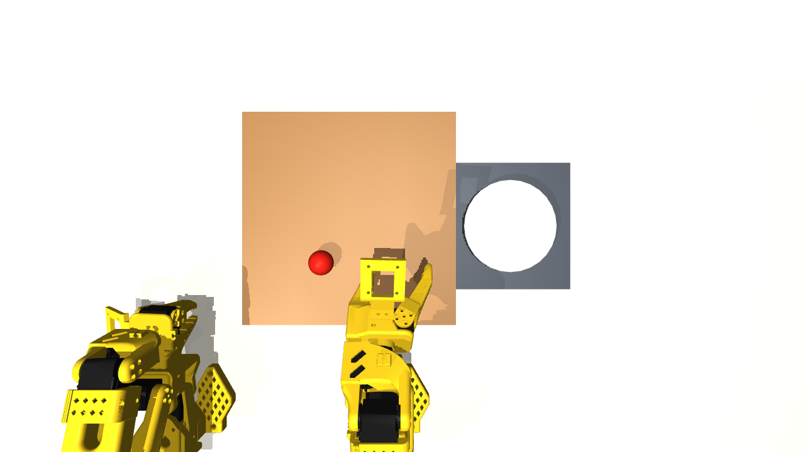
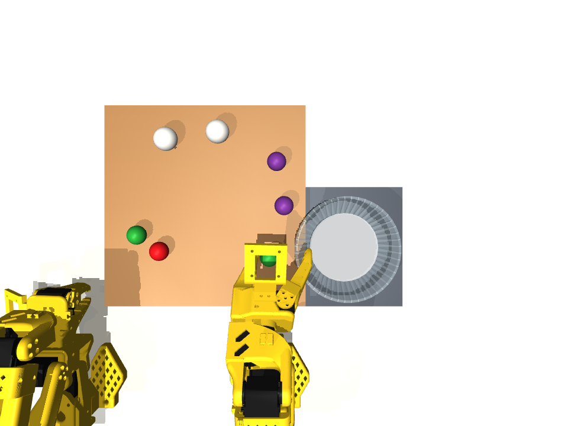
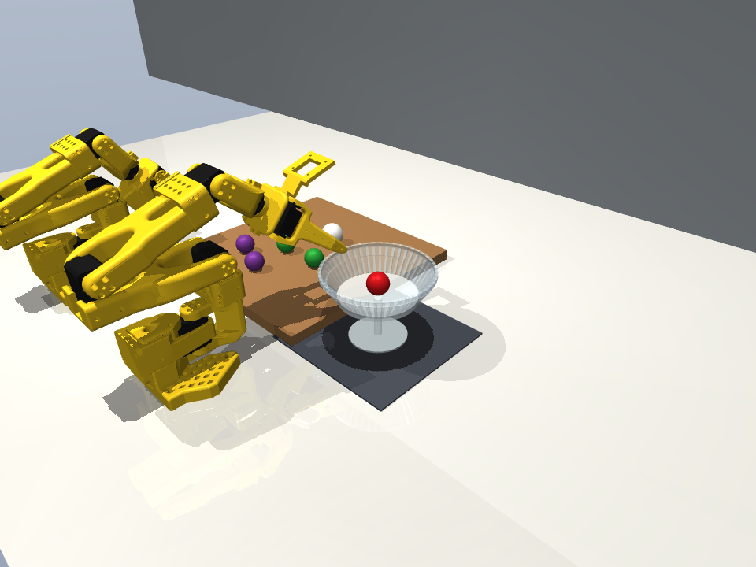
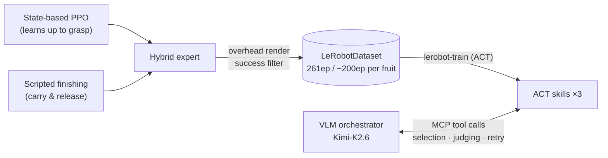

<p align="center">
  
</p>

<p align="center">
  <a href="README.md">日本語</a> · <b>English</b>
</p>

<p align="center">
  <a href="LICENSE"></a>
  <a href="https://huggingface.co/YUGOROU/act_gyoza_pickplace_synth"></a>
  <a href="https://huggingface.co/datasets/YUGOROU/gyoza-pickplace-synth"></a>
  <a href="https://deepwiki.com/YUGOROU/gyoza"></a>
</p>

# gyoza 🥟 — does synthetic data work for small-scale personal robotics?

A research project that teaches cooking skills to a dual-arm SO-101 in simulation with
**zero human demonstrations**. ACT policies are distilled purely from **synthetic data generated by a
hybrid expert** (RL + scripted finishing), then bundled with a VLM orchestrator (selection, postcondition
verification, retry) to complete the long-horizon task **"selective coupe-glass plating"**.
Codebase for a personal research project.

> **Question:** In personal robotics where large-scale expert data cannot be collected, does synthetic
> data actually work for policy learning?

## Key results

| Experiment | Condition | Success rate |
|---|---|---|
| **A. Single skill** (single-ball pick_place, N=50 each) | SmolVLA / π0.5 / MolmoAct2 (zero-shot) | **0/50 ×3 models** |
| | ACT trained on 261 synthetic episodes only | **76%** (38/50) |
| **B. Long-horizon task** (5 sequential steps, N=75/condition) | Sequential, no verification | 13.3% (matches 0.70⁵≒16.8% theory) |
| | VLM verification + retry≤2 | 18.7% (bottleneck = 34% VLM false negatives) |
| | With a perfect judge (estimate) | ≈87% |

**Synthetic data works for skill learning — and once skills are trained, the bottleneck moves from
motion to the perception accuracy of the verification layer.**

<table>
<tr>
<td width="50%"></td>
<td width="50%"></td>
</tr>
<tr>
<td align="center"><sub>Pick only what the recipe calls for (unripe cherries mixed in)</sub></td>
<td align="center"><sub>Five sequential plating steps into the coupe glass</sub></td>
</tr>
</table>

## Architecture — the GYOZA two-layer design

- **VLM orchestrator** (Kimi-K2.6): decides *which* object to grasp, verifies binary postconditions,
  directs retries. Calls ACT skills as **MCP tools**
- **ACT skills** (one per fruit ×3): coordinate-level motion only. Skill granularity = "one postcondition
  binary-judgeable by the VLM from the fixed overhead camera"
- **Synthetic-data factory**: state-based PPO (up to the grasp) + scripted finishing → overhead-camera
  rendering → keep successful episodes only → write directly as a LeRobotDataset



## Repository layout

```
gyoza/
├── gyoza/                      MuJoCo simulation environment and VLA adapters
│   ├── envs/pick_place.py        kitchen env, GT postconditions, env hooks (GYOZA_COUPE etc.)
│   ├── envs/bowl.py              coupe-glass / bowl scene patches
│   ├── envs/place_skill.py       scripted finishing for the expert (carry & release)
│   ├── envs/rl_pick_place.py     state-based env for the RL expert
│   ├── vla/                      SO-101 ⇄ VLA coordinate/unit adapters
│   └── assets/pick_place.xml     scene MJCF (two SO-101s attached from menagerie)
├── jobs/                       HF Jobs experiment pipeline (single-shot uv run scripts)
│   ├── zeroshot_job.py           zero-shot VLA measurement (source of the 0/50)
│   ├── rl_train_job.py           RL expert training (SB3 PPO)
│   ├── act_datagen_job.py        hybrid expert → LeRobotDataset writer
│   ├── act_train_job.py          lerobot-train wrapper (ACT, 100k steps)
│   ├── act_eval_job.py           GT-judged evaluation + videos
│   ├── coupe_ablation_job.py     long-horizon ablation (with/without verification layer)
│   ├── judge_bench_job.py        offline benchmark for the judge VLM
│   └── overnight_orchestrator.py runs datagen→train→eval for 3 fruits in parallel
├── scripts/
│   └── veg_pipeline.py           TRELLIS GLB → real-scale → CoACD convex decomposition → MJCF
├── space/                      HF Space demo (FastAPI + MCP + hermes-agent)
└── docs/assets/                README images
```

## Artifacts (Hugging Face)

Code lives in this repository; **trained policies and datasets on the HF Hub, large assets in an HF
bucket**.

| Kind | Location |
|---|---|
| ACT (synthetic-only, 76%) | [`YUGOROU/act_gyoza_pickplace_synth`](https://huggingface.co/YUGOROU/act_gyoza_pickplace_synth) |
| Per-fruit ACT v2 ×3 | [`act_gyoza_shiratama_v2`](https://huggingface.co/YUGOROU/act_gyoza_shiratama_v2) · [`act_gyoza_grape_v2`](https://huggingface.co/YUGOROU/act_gyoza_grape_v2) · [`act_gyoza_cherry3_v2`](https://huggingface.co/YUGOROU/act_gyoza_cherry3_v2) |
| Synthetic dataset, 261ep | [`YUGOROU/gyoza-pickplace-synth`](https://huggingface.co/datasets/YUGOROU/gyoza-pickplace-synth) |
| Per-fruit datasets ×3 | [`gyoza-fruit2-{shiratama,grape,cherry3}-0711-v1`](https://huggingface.co/datasets/YUGOROU/gyoza-fruit2-shiratama-0711-v1) |
| Food meshes (TRELLIS, 605MB) · RL expert | bucket [`YUGOROU/gyoza-artifacts`](https://huggingface.co/buckets/YUGOROU/gyoza-artifacts) |

## Running

```bash
git clone https://github.com/YUGOROU/gyoza && cd gyoza

# SO-101 MJCF (MuJoCo Menagerie, Apache-2.0)
git clone --depth 1 https://github.com/google-deepmind/mujoco_menagerie third_party/mujoco_menagerie

# Food meshes (TRELLIS-generated, 605MB)
hf buckets cp -r hf://buckets/YUGOROU/gyoza-artifacts/veg gyoza/assets/veg

# Local environment (Python 3.11 / uv)
uv venv && uv pip install "mujoco==3.10.0" "lerobot[smolvla]==0.4.4" gymnasium stable-baselines3 "imageio[ffmpeg]"
```

The experiment pipeline is designed to run on **HF Jobs** (submission commands are in each job's
docstring). Code/assets are mirrored to a bucket and mounted with `-v hf://buckets/<owner>/<bucket>:/gyoza`.

```bash
# e.g. synthetic datagen → ACT training → evaluation
hf jobs uv run jobs/act_datagen_job.py --flavor t4-small ...
hf jobs uv run jobs/act_train_job.py  --flavor a100-large ...
hf jobs uv run jobs/act_eval_job.py   --flavor t4-small ...
```

### Implementation notes (gotchas)

- **lerobot 0.4.4**: normalization lives in a processor pipeline *outside* the model. Always run
  evaluation through `make_pre_post_processors()` — `ACTPolicy.from_pretrained` alone collapses to
  constant actions
- **Units**: degrees at the adapter boundary, radians in MJCF. Actions are 6-D absolute joint targets
  (degrees) at 30 Hz
- Never decimate the visual meshes (UV inheritance breaks at TRELLIS atlas seams). ~290k faces render fine

## License & attribution

- Code in this repository: **MIT**
- [MuJoCo Menagerie](https://github.com/google-deepmind/mujoco_menagerie) (Apache-2.0) is cloned, not vendored
- Food meshes generated with [TRELLIS](https://github.com/microsoft/TRELLIS)
- Baselines: [SmolVLA](https://huggingface.co/papers/2506.01844) · [π0.5](https://huggingface.co/papers/2504.16054) · [MolmoAct2](https://huggingface.co/papers/2605.02881)

## Acknowledgements

Thanks to my mentors.
Claude Fable 5 (Anthropic) assisted with development and design; experimental design and decisions are the author's.
