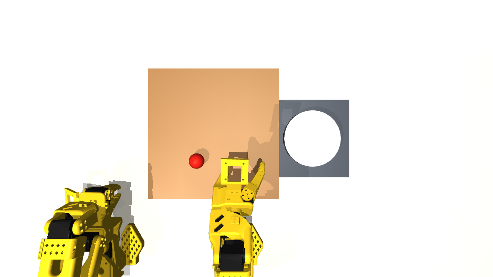

# GYOZA

[English](README.md)

MuJoCo上で、視覚によるhigh-level orchestrationと特化したmanipulation policyを組み合わせる調理ロボット研究。

## Idea

物体選択・結果検証と、動作の実行を分離します。vision-language orchestratorが、RLとスクリプトを組み合わせたexpertの合成データで学習したACT skillを呼び出します。

## Current status

- **合成データ261 episode**で学習したACT pick-and-place policyが、simulationで**38/50成功（76%）**を記録しました。[policy](https://huggingface.co/YUGOROU/act_gyoza_pickplace_synth)と[dataset](https://huggingface.co/datasets/YUGOROU/gyoza-pickplace-synth)は別途公開しています。
- 5工程のクープグラス盛り付け実験では、**検証なしで10/75系列、VLM検証とretryありで14/75系列**が完了しました。差は統計的に区別できませんでした。
- データ生成、ACT学習・評価、replay機能を持つMCPベースのorchestration demoを収録しています。

## How it works

1. PPOによる把持と、スクリプトによる運搬・リリースを組み合わせてexpertを構成します。
2. 成功trajectoryと俯瞰RGB観測をACTの学習データにします。
3. 特化したACT policyがmanipulation skillを実行します。
4. demo orchestratorが物体を選択し、MCP経由でskillを呼び出し、結果を確認してretryを指示します。

## Notes

結果はsimulationに限定されます。sceneにはSO-101が2台ありますが、pick-and-place baselineでは補助armを固定しています。検証層のablationはdemo agentではなくスクリプトで駆動しています。以前のzero-shot VLA測定は異なるscene layoutを使用しています。

実験jobには外部モデル・asset・Linux描画環境が必要です。コマンドとパラメータはjob scriptに記載しています。コードはMIT licenseで、外部assetと依存関係にはそれぞれのlicenseが適用されます。
