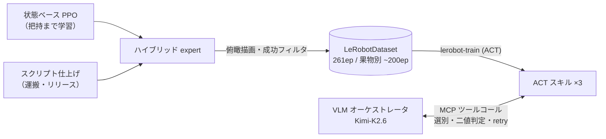

<p align="center">
  
</p>

<p align="center">
  <b>日本語</b> · <a href="README.en.md">English</a>
</p>

<p align="center">
  <a href="LICENSE"></a>
  <a href="https://huggingface.co/YUGOROU/act_gyoza_pickplace_synth"></a>
  <a href="https://huggingface.co/datasets/YUGOROU/gyoza-pickplace-synth"></a>
  <a href="https://deepwiki.com/YUGOROU/gyoza"></a>
</p>

# gyoza 🥟 — 小規模ロボティクスにおける合成データを利用した学習の有効性

**人の実演データゼロ**で、sim 内の双腕 SO-101 に調理スキルを学習させる研究プロジェクト。
RL とスクリプトを接続した**ハイブリッド expert が生成する合成データのみ**で ACT ポリシーを蒸留し、
VLM オーケストレータ（選別判断・事後条件検証・retry 指揮）と束ねて長時間タスク
**「選別つきクープグラス盛り付け」** を完走させる。N高等学校 研究部ポスター発表（2026-08-10 @東大）の実験コードベース。

> **問い**: 大規模な専門家データを集められない個人ロボティクスで、合成データはポリシー学習に効くのか?

## 主結果

| 検証 | 条件 | 成功率 |
|---|---|---|
| **A. スキル単体**（単一球 pick_place・各 N=50） | SmolVLA / π0.5 / MolmoAct2（zero-shot） | **0/50 ×3モデル** |
| | 合成データ 261ep のみで学習した ACT | **76%**（38/50） |
| **B. 長時間タスク**（5工程直列・N=75/条件） | 検証なしで直列実行 | 13.3%（理論値 0.70⁵≒16.8% と整合） |
| | VLM 検証 + retry≤2 | 18.7%（律速 = 判定 VLM の偽陰性 34%） |
| | 判定が完璧な場合（試算） | ≈87% |

**合成データはスキル学習に効く。そしてスキルを鍛えた後、律速は動作から検証層の知覚精度へ移る。**

<table>
<tr>
<td width="50%"></td>
<td width="50%"></td>
</tr>
<tr>
<td align="center"><sub>レシピに合う果物だけを選ぶ（未熟なさくらんぼが混在）</sub></td>
<td align="center"><sub>クープグラスへ5工程の直列盛り付け</sub></td>
</tr>
</table>

## 構成 — GYOZA 二層アーキテクチャ

- **VLM オーケストレータ**（Kimi-K2.6）: 「どれを掴むか」の選別判断・事後条件の二値判定・retry の指揮。ACT スキルを **MCP ツール**として呼ぶ
- **ACT スキル**（果物別 ×3）: 座標レベルの動作のみを担う。スキルの粒度は「俯瞰カメラから VLM が二値判定できる事後条件 1 つ」
- **合成データ工場**: 座標入力の PPO（把持まで）+ スクリプト仕上げのハイブリッド expert → 俯瞰カメラ描画 → 成功エピソードのみフィルタ → LeRobotDataset 直接書き出し



## リポジトリ構成

```
gyoza/
├── gyoza/                      MuJoCo シミュレーション環境と VLA アダプタ
│   ├── envs/pick_place.py        キッチン環境・GT 事後条件・環境フック（GYOZA_COUPE 等）
│   ├── envs/bowl.py              クープグラス / 丼へのシーンパッチ
│   ├── envs/place_skill.py       expert のスクリプト仕上げ（運搬・リリース）
│   ├── envs/rl_pick_place.py     RL expert 用の状態ベース環境
│   ├── vla/                      SO-101 ⇄ VLA の座標系・単位アダプタ
│   └── assets/pick_place.xml     シーン MJCF（SO-101 ×2 は menagerie を attach）
├── jobs/                       HF Jobs 実験パイプライン（すべて uv run 単発スクリプト）
│   ├── zeroshot_job.py           既存 VLA ゼロショット測定（0/50 の出どころ）
│   ├── rl_train_job.py           RL expert の学習（SB3 PPO）
│   ├── act_datagen_job.py        ハイブリッド expert → LeRobotDataset 書き出し
│   ├── act_train_job.py          lerobot-train ラッパ（ACT 100k steps）
│   ├── act_eval_job.py           GT 判定つき評価 + 動画
│   ├── coupe_ablation_job.py     長時間タスク ablation（検証層の有無）
│   ├── judge_bench_job.py        判定 VLM のオフラインベンチ
│   └── overnight_orchestrator.py datagen→train→eval を3果物並行で自動実行
├── scripts/
│   └── veg_pipeline.py           TRELLIS GLB → 実寸化 → CoACD 凸分解 → MJCF 組み込み
├── space/                      HF Space デモ（FastAPI + MCP + hermes-agent）
└── docs/assets/                README 用画像
```

## 成果物（Hugging Face）

コードは本リポジトリ、**学習済みポリシーとデータセットは HF Hub、大容量アセットは HF bucket** に置いている。

| 種類 | 場所 |
|---|---|
| ACT（合成のみ・76%） | [`YUGOROU/act_gyoza_pickplace_synth`](https://huggingface.co/YUGOROU/act_gyoza_pickplace_synth) |
| ACT 果物別 v2 ×3 | [`act_gyoza_shiratama_v2`](https://huggingface.co/YUGOROU/act_gyoza_shiratama_v2) · [`act_gyoza_grape_v2`](https://huggingface.co/YUGOROU/act_gyoza_grape_v2) · [`act_gyoza_cherry3_v2`](https://huggingface.co/YUGOROU/act_gyoza_cherry3_v2) |
| 合成データセット 261ep | [`YUGOROU/gyoza-pickplace-synth`](https://huggingface.co/datasets/YUGOROU/gyoza-pickplace-synth) |
| 果物別データセット ×3 | [`gyoza-fruit2-{shiratama,grape,cherry3}-0711-v1`](https://huggingface.co/datasets/YUGOROU/gyoza-fruit2-shiratama-0711-v1) |
| 食材メッシュ（TRELLIS 生成・605MB）・RL expert | bucket [`YUGOROU/gyoza-artifacts`](https://huggingface.co/buckets/YUGOROU/gyoza-artifacts) |

## 動かし方

```bash
git clone https://github.com/YUGOROU/gyoza && cd gyoza

# SO-101 の MJCF（MuJoCo Menagerie・Apache-2.0）
git clone --depth 1 https://github.com/google-deepmind/mujoco_menagerie third_party/mujoco_menagerie

# 食材メッシュ（TRELLIS 生成・605MB）
hf buckets cp -r hf://buckets/YUGOROU/gyoza-artifacts/veg gyoza/assets/veg

# ローカル環境（Python 3.11 / uv）
uv venv && uv pip install "mujoco==3.10.0" "lerobot[smolvla]==0.4.4" gymnasium stable-baselines3 "imageio[ffmpeg]"
```

実験パイプラインは **HF Jobs** で回す設計（各ジョブの docstring に投入コマンドを記載）。
コード・アセットは bucket にミラーし、ジョブは `-v hf://buckets/<owner>/<bucket>:/gyoza` でマウントする。

```bash
# 例: 合成データ生成 → ACT 学習 → 評価
hf jobs uv run jobs/act_datagen_job.py --flavor t4-small ...
hf jobs uv run jobs/act_train_job.py  --flavor a100-large ...
hf jobs uv run jobs/act_eval_job.py   --flavor t4-small ...
```

### 実装ノート（ハマりどころ）

- **lerobot 0.4.4**: 正規化はモデル外の processor パイプライン。評価では `make_pre_post_processors()` を必ず通すこと（`ACTPolicy.from_pretrained` 単体では定数アクションに崩壊する）
- **単位規約**: アダプタ境界は度、MJCF は rad。action は6次元 absolute 関節目標（度）@30Hz
- 視覚メッシュはデシメート禁止（TRELLIS アトラスの UV 継承が破綻する）。~29万面のまま使用して問題ない

## ライセンス・出典

- 本リポジトリのコード: **MIT**
- [MuJoCo Menagerie](https://github.com/google-deepmind/mujoco_menagerie)（Apache-2.0）は同梱せず clone して使用
- 食材メッシュは [TRELLIS](https://github.com/microsoft/TRELLIS) により生成
- 比較対象: [SmolVLA](https://huggingface.co/papers/2506.01844) · [π0.5](https://huggingface.co/papers/2504.16054) · [MolmoAct2](https://huggingface.co/papers/2605.02881)

## 謝辞

メンターの方々ならびに N高等学校 研究部に感謝します。
開発・デザイン支援に Claude Fable 5（Anthropic）を使用しました。実験の設計と意思決定は筆者によるものです。
